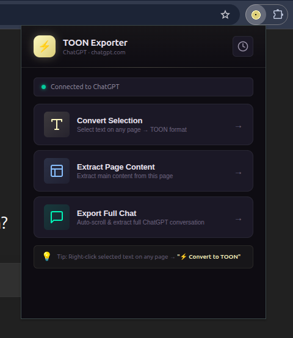

# ⚡ TOON Exporter

> A universal browser extension that converts web content into **TOON (Token-Oriented Object Notation)** — a compact, token-efficient data format designed for LLM workflows.


<p align="center">
  
</p>

---

## 🎯 What Is TOON?

TOON is a tabular, CSV-inspired notation that represents structured data in significantly fewer tokens than JSON or XML. It's ideal for feeding context to LLMs, archiving conversations, and exporting structured web content.

**Example — a chat conversation in TOON:**

```
conversations[3]{role,content}:
  user,How do I reverse a list in Python?
  assistant,"Use slicing: `my_list[::-1]`, or `list.reverse()` for in-place."
  user,Thanks!
```

Compare that to the equivalent JSON — TOON uses **~40-60% fewer tokens**.

---

## ✨ Features

### Universal — Works on Any Website

| Feature | Any Website | ChatGPT | Claude |
|---|---|---|---|
| **Selection → TOON** | ✅ | ✅ | ✅ |
| **Page Content Extraction** | ✅ | ✅ | ✅ |
| **Full Chat Export** | — | ✅ | ✅ |
| **Right-Click Context Menu** | ✅ | ✅ | ✅ |
| **Auto-Scroll & Extract** | — | ✅ | ✅ |

### Smart Structure Detection

The extension automatically detects the structure of your selected text and converts it to the most appropriate TOON format:

- **Chat / Dialogue** → `conversations[N]{role,content}:`
- **Key-Value Pairs** → `data[N]{key,value}:`
- **Lists** → `items[N]{item}:`
- **Paragraphs / Articles** → `content[N]{type,text}:`
- **Raw Blocks** → `content[1]{type,text}:` (single block)

You can also override the auto-detected format manually from the popup.

### Rich Content Extraction

- Preserves **Markdown formatting** (headings, bold, italic, code blocks, links, tables)
- Strips UI artifacts (buttons, icons, avatars, toolbars) from chat platforms
- DOM-to-Markdown converter handles `<pre>`, `<code>`, `<blockquote>`, lists, and more

### Full Chat Export (ChatGPT & Claude)

- **Auto-scrolls** the conversation to load lazy-loaded messages
- **Multi-strategy extraction** — falls back through data attributes, class-based selectors, and markdown blocks
- **Chunking** for large conversations — splits output into manageable pieces with configurable chunk size and character limits

### Export & History

- 📋 **Copy to clipboard** with one click
- 📥 **Download as `.toon` file** with timestamped filename
- 🕑 **Export history** — stores up to 50 recent exports
- Browse, copy, or delete past exports from the history panel

---

## 📦 Project Structure

```
toon/
├── assates/                    # Assets (screenshots, images)
│   └── image.png               # Extension popup screenshot
├── extention/                  # Browser extension (Manifest V3)
│   ├── manifest.json           # Extension configuration
│   ├── popup.html              # Popup UI
│   ├── popup.css               # Popup styles
│   ├── popup.js                # Popup logic & event handling
│   ├── content.js              # Content script — DOM extraction & site detection
│   ├── background.js           # Service worker — context menu & storage
│   ├── toonConverter.js        # TOON format converter module
│   ├── storageManager.js       # Export history persistence
│   └── icons/                  # Extension icons (16, 48, 128 px)
│
└── toon-main/                  # TOON reference implementation (TypeScript monorepo)
    ├── SPEC.md                 # Pointer to the official TOON specification
    ├── packages/               # TypeScript packages
    ├── docs/                   # Documentation (VitePress)
    ├── benchmarks/             # Performance benchmarks
    └── package.json            # Monorepo root
```

---

## 🚀 Installation

### Load as Unpacked Extension (Developer Mode)

1. Open your Chromium-based browser (Chrome, Edge, Brave, Arc, etc.)
2. Navigate to `chrome://extensions/`
3. Enable **Developer mode** (toggle in the top-right corner)
4. Click **Load unpacked**
5. Select the `extention/` directory from this project
6. The ⚡ TOON Exporter icon will appear in your toolbar

> **Tip:** Pin the extension to your toolbar for quick access.

---

## 🛠️ Usage

### Convert Selected Text

1. **Select** any text on any webpage
2. Click the **⚡ TOON Exporter** icon in the toolbar
3. Click **"Convert Selection"**
4. The text is analyzed, auto-formatted, and displayed as TOON
5. **Copy** or **Download** the output

### Right-Click Context Menu

1. **Select** text on any page
2. **Right-click** → click **"⚡ Convert to TOON"**
3. A toast notification confirms the capture
4. Open the extension popup to view and export

### Extract Full Page Content

1. Navigate to any article, blog post, or documentation page
2. Open the extension popup
3. Click **"Extract Page Content"**
4. The main article content is extracted (stripping navbars, ads, sidebars)

### Export Full Chat (ChatGPT / Claude)

1. Open a conversation on **chat.openai.com** or **claude.ai**
2. Open the extension popup
3. Click **"Export Full Chat"**
4. The extension auto-scrolls to load all messages, then extracts the full conversation
5. Large conversations are automatically **chunked** — navigate between chunks with the Prev/Next controls

---

## 🔧 Architecture

### Extension Components

| File | Role |
|---|---|
| `content.js` | Injected into every page. Handles DOM extraction, selection capture, site-specific chat parsing, and auto-scroll. |
| `background.js` | Service worker. Manages the right-click context menu, cross-component messaging, and export history storage. |
| `popup.js` | Popup controller. Orchestrates the UI, delegates extraction to `content.js`, and manages format conversion. |
| `toonConverter.js` | Pure conversion module. Converts data structures (messages, lists, key-value pairs, paragraphs) into TOON format. |
| `storageManager.js` | Persistence layer. CRUD operations on `chrome.storage.local` for export history. |

### Conversion Pipeline

```
User Selection / Page DOM
        │
        ▼
   content.js          ← Extracts text + rich HTML, converts DOM → Markdown
        │
        ▼
   popup.js            ← Receives extracted text, passes to converter
        │
        ▼
  toonConverter.js     ← Detects structure → Converts to TOON format
        │
        ▼
   Output Panel        ← Preview, copy, download, save to history
```

### TOON Format Types

```
# Chat Messages
conversations[2]{role,content}:
  user,Hello!
  assistant,Hi there! How can I help?

# Key-Value Data
data[3]{key,value}:
  Name,Alice
  Role,Engineer
  Team,Platform

# List Items
items[3]{item}:
  Learn Rust
  Build a CLI tool
  Write documentation

# Content Blocks
content[2]{type,text}:
  heading,Getting Started
  paragraph,"This guide walks you through the setup process."
```

---

## ⚙️ Configuration

The converter uses the following defaults (configurable via `toonConverter.js`):

| Setting | Default | Description |
|---|---|---|
| `DEFAULT_CHUNK_SIZE` | `50` | Maximum messages per TOON chunk |
| `DEFAULT_MAX_CHARS_PER_CHUNK` | `32000` | Maximum characters per chunk |
| `MAX_HISTORY_ITEMS` | `50` | Maximum stored export history items |

---

## 🧪 TOON Reference Implementation

The `toon-main/` directory contains the official **TypeScript/JavaScript reference implementation** of the TOON format, organized as a pnpm monorepo. See the [TOON Specification](https://github.com/toon-format/spec) for the full format spec.

```bash
# Install dependencies
cd toon-main && pnpm install

# Build packages
pnpm build

# Run tests
pnpm test

# Start docs dev server
pnpm docs:dev
```

---

## 🤝 Contributing

1. **Fork** the repository
2. Create a feature branch: `git checkout -b feature/my-feature`
3. Make your changes and test thoroughly
4. Commit with a descriptive message
5. Push and open a **Pull Request**

### Development Tips

- Reload the extension after changes: go to `chrome://extensions/` → click the refresh icon
- Open the popup DevTools: right-click the extension icon → "Inspect popup"
- Background script logs: go to `chrome://extensions/` → click "Service worker" under TOON Exporter

---

## 📄 License

This project is licensed under the [MIT License](toon-main/LICENSE).

---

<p align="center">
  <strong>⚡ TOON Exporter</strong> — Fewer tokens. More context. Better LLM workflows.
</p>
